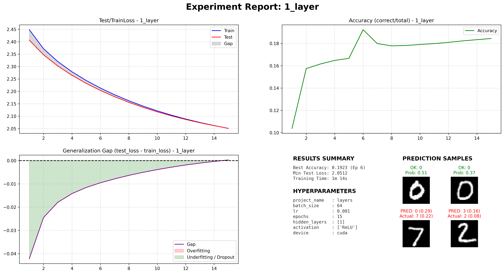
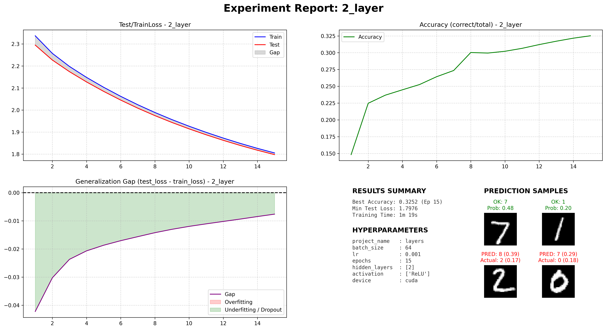

#

# Layers

The MLP (Multilayer perceptron) on QMNIST has a 784 input size, since number images are 28x28.
The output is 10, since it has to choose a number on that range.
The "Hidden layers" are up to us to decide.

For our QMNIST model, the MLP has a 784-node input layer (from the 28 $\times$ 28 image resolution) and a 10-node output layer for digit classification. The architecture of the hidden layers remains flexible, allowing us to play around.

We'll start with 1 neuron only. Now its up to out model to decide the weights and biases
There are 11 biases, 1 for out neuron and 10 for the output neurons, and there are 784 $\times$ 1 + 10 weights for our model to tweek.

Having only one neuron does not leave enough room for our model to learn patterns, though it averages a 21% which is a good starts. How much will 2 neurons improve?

With 12 biases and 784 $\times$ 2 + 2 $\times$ 10

Now its almost twice as accurate than the first one.

How much will change using 2 neurons but a different another layer.
The weights and biases are calculated

$$
\#\text{biases} = \#\text{total\_hidden\_neurons} + \#\text{output\_neurons}
$$

$$
\#\text{weights}
    = (\#\text{input\_layer\_neurons} \times \#\text{fist\_layer\_neurons}) + (\#\text{fist\_layer\_neurons} \times \#\text{second\_layer\_neurons}) + ... + (\#\text{last\_layer\_neurons} \times \#\text{ouptut})
    = \sum_{l=1}^{L} (n_{l-1} \times n_l)
$$
